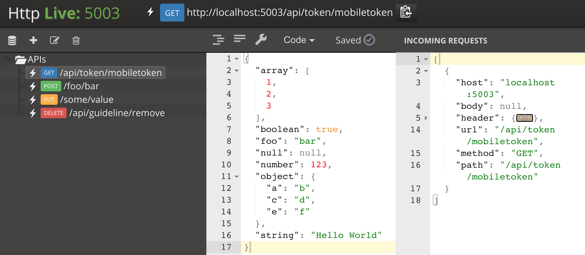
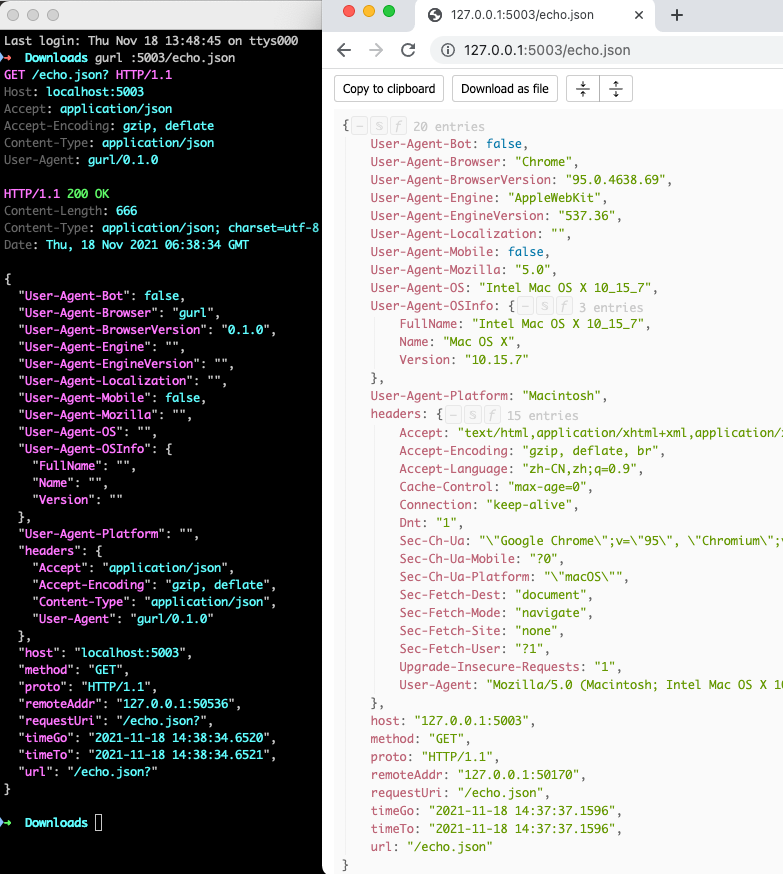

# HttpLive

[](https://travis-ci.org/bingoohuang/httplive)

The **HttpLive** is a tool for **API designers, Proxy, mobile and web application developers**
to develop and test their applications faster without being dependent on any server or backend applications.



HttpLive has a built-in user interface. Therefore, you can do all the configurations you need on this UI,
and with dynamic URL (Routing) definitions you can specify your own JSON return types for your applications.

You can share the key-value database (**httplive.db**) with your teammates, easily back up or store it in the any cloud storage.

Load balancing, Round-robin operations can be operated easily with multi-port mode.

With the support of HttpLive you; we can make it more useful without compromising on simple usage
and increase the productivity of our development and testing environments.

## Features

1. 2022-04-08 support serve static files, see demo config [servestatic.json](assets/servestatic.json)
1. 2022-04-07 counter api op==all/query/incr/deduct/reset key/k==counterName value/val/v=1/-1/incremental 
   1. `gurl :5003/counter -pb -r`  => `{"counter":23}`
   2. `gurl :5003/counter op==query -pb -r` => `{"counter":23}`
   2. `gurl :5003/counter op==deduct -pb -r` => `{"counter":22}`
   2. `gurl :5003/counter op==reset -pb -r` => `{"counter":0}`
2. 2021-12-01 admin api made more easy
    - `curl 'http://127.0.0.1:5003/httplive/webcli/api/save?endpoint=/x1' -d '{"close": true}'` 
    - `curl 'http://127.0.0.1:5003/httplive/webcli/api/save?endpoint=/x1' -d '@a.json` 
    - `curl 'http://127.0.0.1:5003/httplive/webcli/api/save?endpoint=/x2&method=GET' -d '{"Status": true}'`
3. 2021-11-18 `http://127.0.0.1:5003/echo.json` returns user agent string's parsing results[^1]

## Installation

    go get github.com/bingoohuang/httplive/...

With this command you can add the **httplive** application to the path you specify in the Go environment.
This way you can run the application from the command line.

Make sure your PATH includes the \$GOPATH/bin directory so your commands can be easily used with help (-h) flag:

    httplive -h

## Arguments

    --dbpath, -d

Fullpath of the httplive.db with forward slash.

    --ports, -p

Hosting ports can be array comma separated string <5003,5004> to host multiple endpoints. First value of the array is the default port.

HttpLive creates a key-value database for the URLs you define.
Here the port value is used as a **bucket name** for the keys.
When working with a single port, the data is associated with this port as keys.
When you specify multiple ports, the first value of the array is selected as the default port,
and the other ports use the data specified for the default port.

For httplive application running with port 5003:

    GET/api/guideline/mobiletoken

this key will be stored in the **bucket 5003**. Therefor if you running app as single port with 5004
you cannot access the keys of 5003 port. You can use multi-port host to overcome this situation.

## Compiling the UI into the Go binary

    go install -ldflags="-s -w" ./...

## Todo

Tests

CI Build Integration.

Simple console to display the information of the incoming request under the UI editor. (WebSocket)

Upload a database file from the web interface.

[Watch the video](https://youtu.be/AG5_llcBogk)

## Resources

- [HTTP & HTTPS proxy with Web UI](https://github.com/lqqyt2423/go-mitmproxy)
- [endpoints.dev store the details of any HTTP request and display them](https://www.endpoints.dev/)
- [Smocker is a simple and efficient HTTP mock server](https://github.com/Thiht/smocker)

## Extensions

1. Dynamic demo [config demo](assets/dynamicdemo.json)
1. Proxy demo [config demo](assets/proxydemo.json)

httpie test

```bash
[2020-11-16 23:42:36.476] ❯ http :5003/dynamic/demo name=bingoo
HTTP/1.1 200 OK
Content-Length: 33
Content-Type: application/json; charset=utf-8
Date: Mon, 16 Nov 2020 16:16:51 GMT

{
    "name": "bingoo"
}


[2020-11-17 00:16:51.399] ❯ http :5003/dynamic/demo name=huang
HTTP/1.1 200 OK
Content-Length: 54
Content-Type: application/json; charset=utf-8
Date: Mon, 16 Nov 2020 16:17:15 GMT

{
    "age": 100,
    "name": "huangxxx"
}
```

gobench test

```bash
[2020-11-17 00:19:47.157] ❯ gobench -u http://127.0.0.1:5003/dynamic/demo --method POST -postData '{"name":"huang"}' -p 0
Dispatching 100 goroutines
Waiting for results...
[√] [200] { "name":"huangxxx", "age":100 }..........
Total Requests:                 658917 hits
Successful requests:            658917 hits
Network failed:                 0 hits
Bad requests(!2xx):             0 hits
Successful requests rate:       65873 hits/sec
Read throughput:                11 MiB/sec
Write throughput:               11 MiB/sec
Test time:                      10.002748474s
```

sleep in mockbin format demo:

1. [httpstat go version](https://www.github.com/davecheney/httpstat)

    ```bash
    [ 22:17:49 ] ❯ http  "http://127.0.0.1:5003/mockbin?_hl=conf"
    HTTP/1.1 200 OK
    Content-Length: 55
    Content-Type: application/json; charset=utf-8
    Date: Mon, 14 Dec 2020 03:18:37 GMT

    {
        "method": "GET",
        "sleep": "1s",
        "status": 200
    }

    [ 22:17:44 ] ❯ httpstat  "http://127.0.0.1:5003/mockbin?_hl=sleep100ms"

    Connected to 127.0.0.1:5003

    HTTP/1.1 200 OK
    Content-Length: 0
    Content-Type: text/plain; charset=utf-8
    Date: Mon, 14 Dec 2020 03:17:49 GMT

    Body discarded

    DNS Lookup   TCP Connection   Server Processing   Content Transfer
    [       0ms  |           0ms  |           1102ms  |             0ms  ]
                |                |                   |                  |
        namelookup:0ms            |                   |                  |
                            connect:0ms               |                  |
                                        starttransfer:1102ms           |
                                                                    total:1103ms
    ```


[^1]: 


